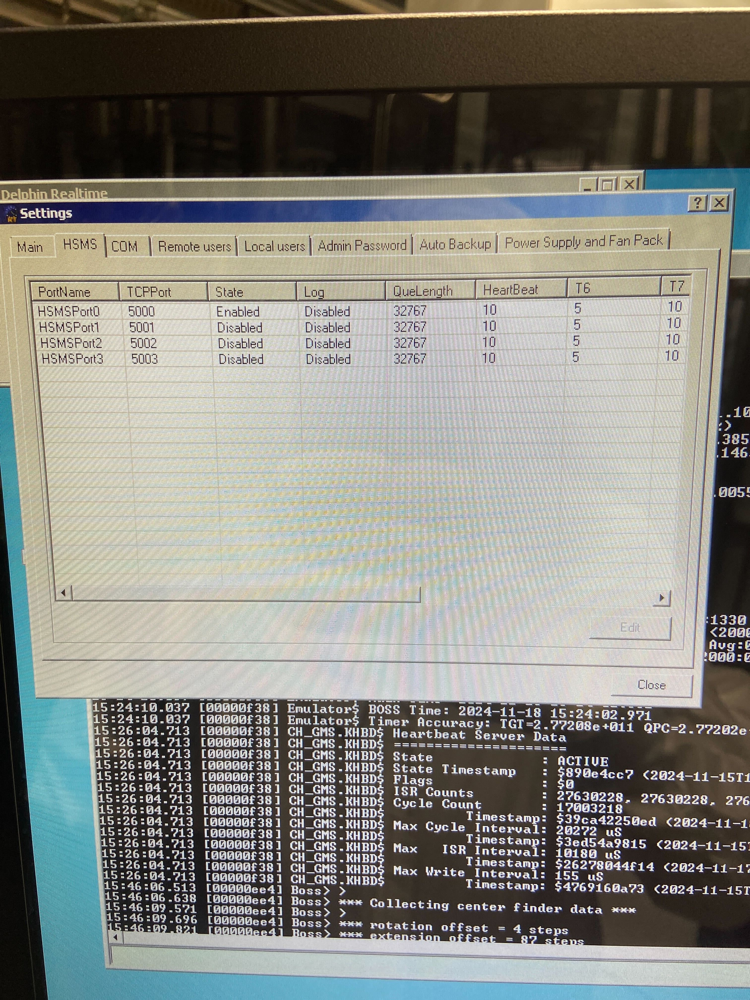
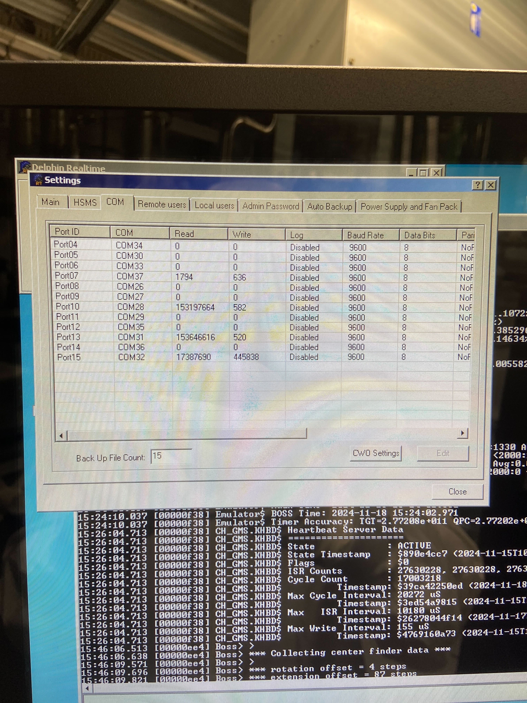

# SECS/GEM Data Capture Project

## Overview
This project aims to capture and monitor data via the **SECS/GEM protocol** over an Ethernet connection. By leveraging the linked Python scripts and HSMS communication settings, the goal is to track specific values (such as SVIDs) over time, perform analytics like summing their values, and ensure proper communication with semiconductor equipment. The project uses an **HSMS (High-Speed SECS Message Services)** interface for communication.

---

## Features
1. **HSMS Protocol Support**:
   - Communication with equipment through HSMS ports.
   - TCP/IP setup for data transfer and logging.

2. **Data Tracking**:
   - Monitor SVID (Status Variable ID) values over time.
   - Perform computations (e.g., sum values) on tracked data.

3. **Python Integration**:
   - Python scripts designed for seamless data handling.
   - Scripts use documented libraries and ChatGPT-generated logic for efficient development.

---

## Requirements
1. **Hardware**:
   - Ethernet-connected semiconductor equipment supporting SECS/GEM communication.
   - Access to a system capable of running Python scripts and setting up HSMS communication.

2. **Software**:
   - Python 3.x
   - Relevant Python libraries (e.g., `pysecs`, `pyhsms`, or similar).
   - The provided scripts for initialization and monitoring.

---

## Configuration
### HSMS Port Setup
- **TCP/IP Configuration**:
  - Port 5000 for primary communication.
  - Configurable queue lengths, heartbeat intervals, and logging as shown in the GUI below.

- **Ports Overview**:
  - **HSMSPort0**: Enabled for data communication.
  - Others: Disabled, but can be enabled as needed.

### COM Port Setup
- Individual COM port configurations are defined with baud rates, data bits, and logging options.
- Each port corresponds to specific hardware communication channels.
  
---

## Implementation
1. **Python Scripts**:
   - Scripts are included in the repository to handle SECS/GEM communication.
   - Configurations for HSMS ports, TCP/IP connections, and specific SVID tracking are prepopulated.

2. **Tracking Logic**:
   - Each SVID's value is periodically captured and logged.
   - Analysis can be performed (e.g., summing values or identifying trends).

3. **Communication Flow**:
   - Establish connection using HSMS.
   - Monitor and log SVIDs through the Python application.
   - Visualize or analyze data as required.

---

## Usage Instructions
1. Clone the repository.
2. Set up your environment with the required Python libraries.
3. Configure the Python scripts with the correct HSMS and COM port parameters.
4. Run the Python application to start monitoring and capturing data.

---

## Screenshots
### HSMS Port Configuration

### COM Port Configuration

---

## Notes
- The configuration shown in the GUI above has been pre-populated with relevant details (e.g., TCP ports and queue lengths).
- Ensure the correct SECS/GEM compliance of your equipment for optimal results.
- All Python scripts are located in the attached directory. Use them as a starting point for customization.

---

For further assistance, please refer to the documentation in the repository or contact the project maintainer.
